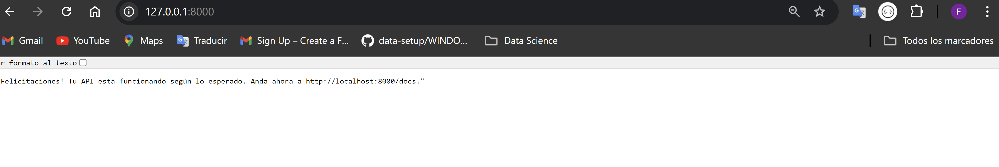
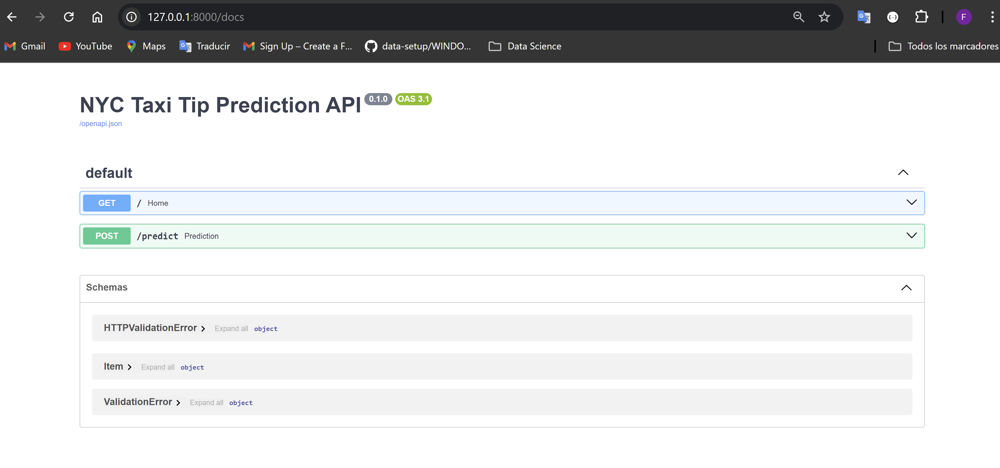
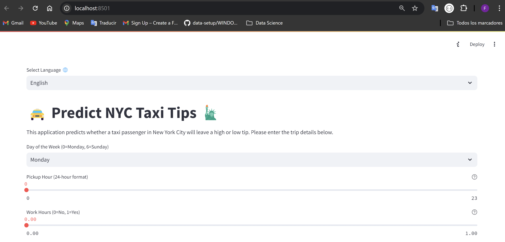
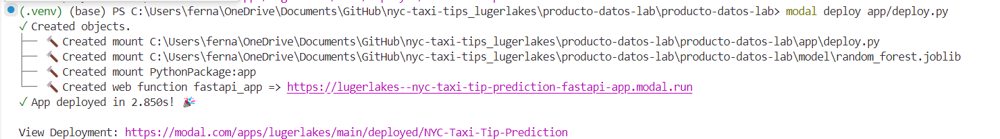
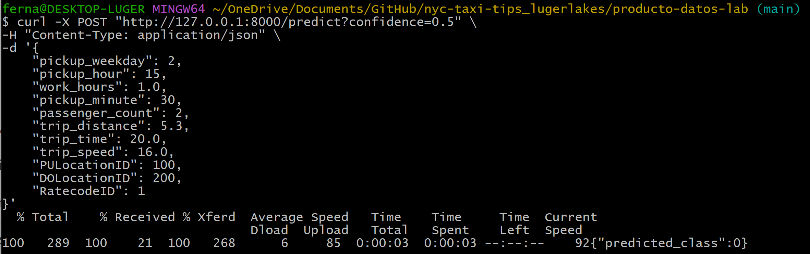
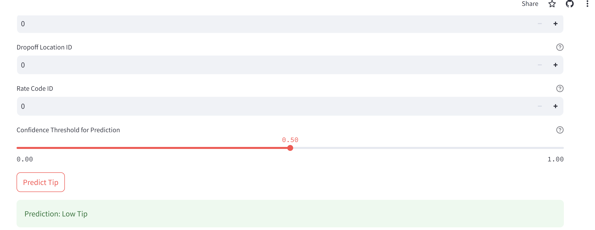

# NYC Taxi Tip Prediction 🗽🚖

## Descripción

Este proyecto transforma el repositorio existente `producto-datos-lab` en una aplicación completa que predice si un pasajero de taxi en la ciudad de Nueva York dejará una propina alta o baja. La aplicación consta de un backend implementado con FastAPI, un frontend (interfaz gráfica de usuario) desarrollada en Streamlit, y un despliegue serverless en la nube utilizando Modal.

### Características Principales

- **Backend con FastAPI**: Un API que recibe las características del viaje en taxi y devuelve la predicción de si la propina será alta o baja.
- **Interfaz de Usuario con Streamlit**: Una GUI intuitiva que permite a los usuarios ingresar los detalles del viaje y visualizar la predicción.
- **Despliegue Serverless en Modal**: La aplicación está desplegada en un entorno serverless para garantizar escalabilidad y fácil acceso desde cualquier lugar.

## Tabla de Contenidos

- [Instalación](#instalación)
  - [Requisitos Previos](#requisitos-previos)
  - [Configuración del Entorno Local](#configuración-del-entorno-local)
- [Despliegue en Modal](#despliegue-en-modal)
- [Uso](#uso)
  - [Interacción a través de Streamlit](#interacción-a-través-de-streamlit)
  - [Acceso al API](#acceso-al-api)
- [Licencia](#licencia)

## Instalación

### Requisitos Previos

Asegúrate de tener instalados los siguientes elementos en tu máquina:

- Visual Studio Code
- Python 3.8 o superior
- pip
- [Git](https://git-scm.com/downloads)
- Cuenta en [Modal](https://modal.com)

### Configuración del Entorno Local

1. **Realizar un fork del repositorio `producto-datos-lab`** y clonar el fork en tu máquina:
   Entra en GitHub y haz clic en el botón 'Fork' en la página del repositorio 'producto-datos-lab'.
   Clonar el fork en tu máquina: En la carpeta local del nuevo repositorio, haz click en botón derecho y presiona 'Guit Bash here', luego ingresa lo siguiente en la terminal.
    ```bash
    git init
    git clone https://github.com/aastroza/producto-datos-lab.git
    cd producto-datos-lab
    code . # Se abrirá Visual Studio Code en tu PC
    ```
2. **Editar `requirements.txt`** para asegurar que todas las dependencias necesarias están listadas.

3. **Crear un nuevo ambiente virtual en Python**:
  En la PowerShell, dirigete a la carpeta del respositorio e ingresa:
    ```bash
    python -m venv .venv
    ```

4. **Activar el nuevo entorno virtual**:
    ```bash
    .\.venv\Scripts\activate
    ```

5. **Instalar las dependencias**:
    ```bash
    pip install -r requirements.txt
    ```

6. **Eliminar la carpeta `model` redundante en `app/`** 

7. **Crear el archivo `predict.py`** en la carpeta `app/` con la lógica de predicción.

8. **Crear el archivo `main.py`** en la carpeta `app/` para definir el API de FastAPI.

9. **Crear un archivo `__init__.py`** en la carpeta `app/` para definirla como un módulo Python.

10. **Crear el archivo `deploy.py`** en la carpeta `app/` para configurar el despliegue en Modal.

11. **Crear el archivo `frontend/app.py`** para definir la interfaz de usuario en Streamlit.

12. **Probar la API localmente**:
    ```bash
    uvicorn app.main:app --reload
    ```
    Se mostrará en tu navegador la URL http://127.0.0.1:8000/ 

    Si ingresas a http://127.0.0.1:8000/docs se mostrará 

13. **Probar la interfaz de usuario localmente**:
    ```bash
    streamlit run frontend/app.py
    ```
    Se desplegará una URL local (En mi caso https://192.168.1.149:8501) 

### Despliegue en Modal

1. **Configurar Modal con `modal token new`** y autorizar la conexión con tu cuenta.

2. **Desplegar la aplicación en Modal**:
    ```bash
    modal deploy app/deploy.py
    ```
    En la PowerShell de Visual Studio Code se visualizará algo parecido a este 
    Selecciona y copia la URL "https://lugerlakes--ntc-taxi-tip-prediction-fastapi-app.modal.run"

3. **Obtener la URL del servicio proporcionada por Modal al desplegar la API**  
    Selecciona y copia la URL "https://lugerlakes--ntc-taxi-tip-prediction-fastapi-app.modal.run" y reemplazala en el request.post del archivo `frontend/app.py`:

    ```python
    response = requests.post(
        "https://lugerlakes--ntc-taxi-tip-prediction-fastapi-app.modal.run/predict", # URL de Modal
        json=features,
        params={"confidence": confidence}
    )
    ```

4. **Ejecutar la interfaz de usuario de Streamlit de manera serverless**:
    ```bash
    streamlit run frontend/app.py
    ```
   Esto desplegará la URL del frontend en entorno local (En mi caso https://192.168.1.149:8501), luego pincha el botón 'deploy' al costado derecho superior de la página web, y elige la opción 'Streamlit Community Cloud' y luego 'Deploy now', 
   lo que permitirá desplegar la interfaz para ser usada desde cualquier dispositivo conectado a internet, utilizando la siguiente URL (`https://nyc-taxi-tip-prediction.streamlit.app/`)  

## Uso

### Acceso al API

Si solo quieres interactuar con la API y no con el frontend, una forma es usando herramientas como `curl` enviando una solicitud POST con el siguiente formato en Git Bash:
```bash
 curl -X POST "http://127.0.0.1:8000/predict?confidence=0.5" \
-H "Content-Type: application/json" \
-d '{
    "pickup_weekday": 2,
    "pickup_hour": 15,
    "work_hours": 1.0,
    "pickup_minute": 30,
    "passenger_count": 2,
    "trip_distance": 5.3,
    "trip_time": 20.0,
    "trip_speed": 16.0,
    "PULocationID": 100,
    "DOLocationID": 200,
    "RatecodeID": 1
}'
```
La respuesta indicará si se espera una propina alta o baja. 

### Interacción a través de Streamlit

#### Entorno Local:
-  **Probar la interfaz de usuario localmente**:
      ```bash
      streamlit run frontend/app.py
      ```
      Se desplegará una URL local (En mi caso https://192.168.1.149:8501) 
- Ingresa los detalles del viaje en taxi.
- Haz clic en "Predecir Propina" para recibir una predicción.

#### Serverless:
- **Desde cualquier navegador**, ingresa a la URL [proporcionada por Streamlit.](https://nyc-taxi-tip-prediction.streamlit.app/)
- Ingresa los detalles del viaje en taxi.
- Haz clic en "Predecir Propina" para recibir una predicción. 

## Licencia
Este proyecto está licenciado bajo la Licencia MIT.